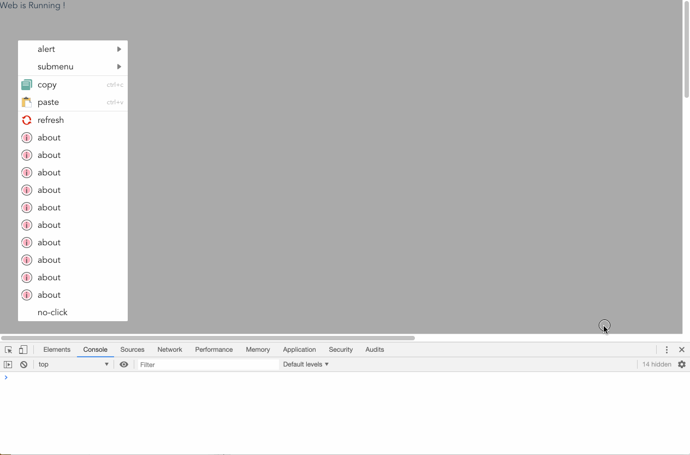
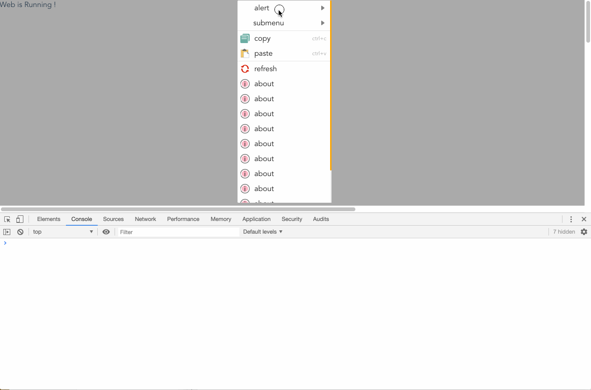
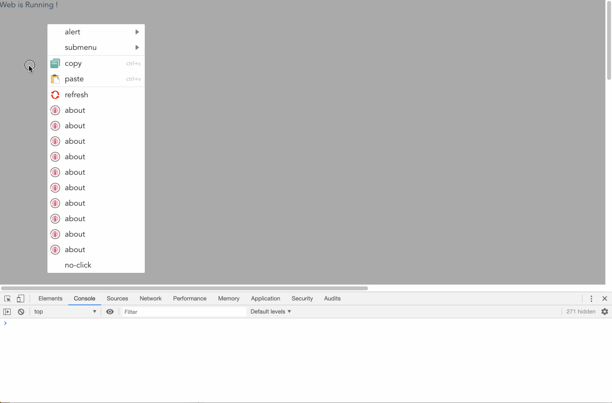
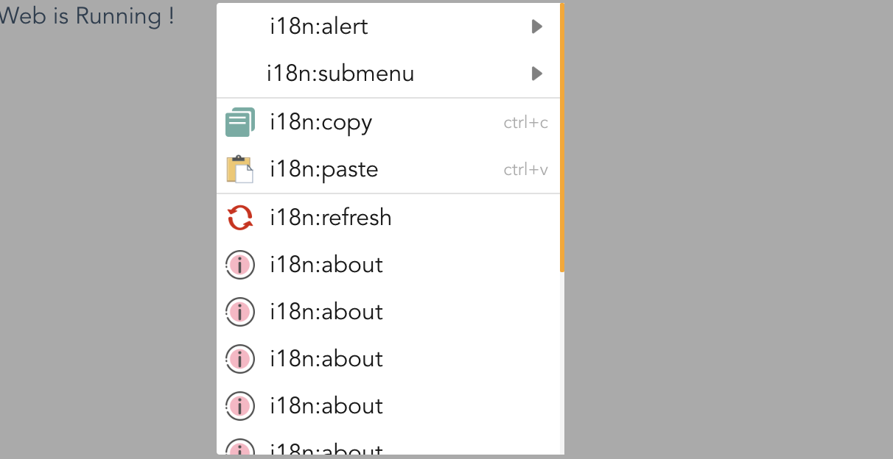

# Html5 ContextMenu


- [X] support html5 and other framework sub as vue
- [X] item icon & hotkey string & submenu arrow
- [X] auto size
- [X] custom css
- [X] simply & easily
- [X] auto hide (when click outer or resize)
- [X] auto adjust location(keep menu in browser of visibility area)
- [X] infinite sub level

### Install
```sh
npm i web-contextmenu
# or
yarn add web-contextmenu
```
### ScreenCap

- auto locate

- clickable & scrollable

- auto hide


### Usage in html5

```html
<!DOCTYPE html>
<html lang="en">
<head>
    <meta charset="UTF-8">
    <title>ContextMenu</title>

    <!--  import contextmenu js & css  -->
    <script type="text/javascript" src="../contextmenu.js"></script>
    <link type="text/css" rel="stylesheet" href="./contextmenu.css">

    <style>
        html,
        body{
            margin: 0;
            padding: 0;
        }
        body {
            font-family: "Avenir", Helvetica, Arial, sans-serif;
            -webkit-font-smoothing: antialiased;
            -moz-osx-font-smoothing: grayscale;
            color: #2c3e50;
        }
        .big{
            width: 2048px;
            height: 2048px;
            background: #aaaaaa;
        }
    </style>
</head>
<body>

<div class="big">Web is Running !</div>

<script type="text/javascript" >

    // build menu list
    const builder = ContextMenu.builder();
    builder.item("refresh", () => {
        location.reload();
    });
    const menulist=builder.build();

    // register aotuhide events
    ContextMenu.install();

    // get target element
    const div=document.getElementsByClassName("big")[0];
    // bind contextmenu event
    div.oncontextmenu=()=>{
        ContextMenu.show(menulist);
    };

</script>

</body>
</html>


```


### Usage in Vue

```javascript

// import js & css global @file: "src/main.js"

import Vue from "vue";

import ContextMenu from "web-contextmenu";
import "web-contextmenu/contextmenu/dist/contextmenu.css";
Vue.use(ContextMenu);

```

```vue

<!-- use in vue  -->

<template>
    <div @contextmenu="$menu.show(menulist)"></div>
</template>

<script>
export default {
    computed:{
        menulist(){
            const builder = ContextMenu.builder();
            builder.item("refresh", () => {
                location.reload();
            });
            return builder.build();
        }
    },
}
</script>

```


### Usage in React
```javascript

// import js & css global @file: "src/index.js"

import ContextMenu from "web-contextmenu/contextmenu";
import "web-contextmenu/contextmenu/dist/contextmenu.css";

ContextMenu.install();

```

```react

// use contextmenu in react

class Login extends React.Component {

    // ...

    handleContextMenu(e){
        console.log(e)
        const builder = ContextMenu.builder();
        builder.item("refresh", (m) => {
            alert(m.name)
        });
        ContextMenu.show(builder.build());
    }
    // ...
    render() {
        return (
            <div id='login-page' onContextMenu={this.handleContextMenu}>
            </div>
        )
    }
}
```

### MenuBuilder

````javascript

// get builder
const builder = ContextMenu.builder();

// add menu item

// only name
builder.item("alert");

// name with click function
builder.item("alert",(m)=>{
    //
    alert(m.name);
});

// name with with click function and hotkey desc
builder.item("alert",(m)=>{
    //
    alert(m.name);
},"ctrl+c");


// name with with click function and hotkey desc and icon
builder.item("alert",(m)=>{
    //
    alert(m.name);
},"ctrl+c", "./icon/copy.png");

// add submenu
builder.item("alert", null, subMenuBuilder => {
    subMenuBuilder.item("alert1");
    subMenuBuilder.item("alert2", null,subMenuBuilder=>{
        //...
    });
});

// gen menulist
const menulist = builder.build();


// full demo
const menulist = (function () {
    const toast = function (m) {
        alert(m.index + ":" + m.name);
    };
    const builder = ContextMenu.builder();
    builder.item("alert", null, b => {
        b.item("alert1", toast);
        b.item("alert2", toast);
    });

    builder.item("submenu", toast, b => {
        b.item("中文中文中文中文中文中文中文", toast);
        b.item("EnglishEnglishEnglishEnglish", toast, b => {
            b.item("中文中文中文中文中文中文中文", toast);
            b.item("EnglishEnglishEnglishEnglish", toast, b => {
                b.item("中文中文中文中文中文中文中文", toast);
                b.item("EnglishEnglishEnglishEnglish", toast);
            });
        });
    });

    builder.divider();

    builder.item("copy", copy, "ctrl+c", "./icon/copy.png");
    builder.item("paste", paste, "ctrl+v", "./icon/paste.png");

    builder.divider();

    builder.item(
        "refresh",
        () => {
            location.reload();
        },
        null,
        "./icon/refresh.png"
    );
    for(let i=0;i<10;i++){
        builder.item("about", toast, null, "./icon/about.png");
    }
    builder.item("no-click");


    return builder.build();
})();

````

### I18N

```javascript

ContextMenu.i18n = (key) => {
    // replace this method in your use
    return "i18n:" + key;
}

```


### Custom CSS

> supported custom css style

```css
# see "web-contextmenu/contextmenu/dist/contextmenu.css"
# and define yourself css to override inner css
```
### Build


```sh
# serve
yarn serve

# build
yarn build
```

### Dependencies


- [X] [typescript](https://www.typescriptlang.org/)
- [X] [rollup](https://www.rollupjs.com/) : generate libs `js` `ts` `css`
- [X] [html2canvas](https://html2canvas.hertzen.com/) : compute the menubox size
- [X] [babel](https://babeljs.io/)
- [X] some other dev and package plugins see [package.json](./package.json)


### License

[LGPL-3.0-or-later](./GNU-AGPL-3.0.txt)
